<div align="center">


# 🧠 OmniMind

### An Integrated Mental Health Monitoring System with Real-Time Emotion Detection and Adaptive Therapeutic Interventions

[](https://flutter.dev)
[](https://python.org)
[](https://firebase.google.com)
[](https://ai.meta.com/llama/)
[](https://ai.google.dev)
[](LICENSE)
[](https://iba-suk.edu.pk)

<br/>

> **OmniMind** is an AI-powered mental health companion that delivers continuous emotional monitoring, clinically validated assessments, and personalized therapeutic interventions — accessible anytime, anywhere, without stigma.

<br/>

[📱 App Screens](#-app-screens) • [🏗️ Architecture](#️-system-architecture) • [✨ Features](#-features) • [🤖 AI & ML Pipeline](#-ai--ml-pipeline) • [🚀 Getting Started](#-getting-started) • [📊 Results](#-results--evaluation) • [👥 Team](#-team)

</div>

---

## 📋 Table of Contents

- [About the Project](#-about-the-project)
- [App Screens](#-app-screens)
  - [Authentication](#authentication)
  - [Patient Experience](#patient-experience)
  - [Doctor / Clinician Experience](#doctor--clinician-experience)
- [System Architecture](#️-system-architecture)
- [Features](#-features)
- [AI & ML Pipeline](#-ai--ml-pipeline)
- [Clinical Assessment Module](#-clinical-assessment-module)
- [Technology Stack](#️-technology-stack)
- [Project Structure](#-project-structure)
- [Getting Started](#-getting-started)
  - [Prerequisites](#prerequisites)
  - [Flutter App Setup](#flutter-app-setup)
  - [Python Backend & Fine-Tuning Setup](#python-backend--fine-tuning-setup)
  - [Firebase Configuration](#firebase-configuration)
- [Environment Variables](#-environment-variables)
- [Results & Evaluation](#-results--evaluation)
- [Ethical & Privacy Considerations](#️-ethical--privacy-considerations)
- [Limitations](#-limitations)
- [Future Work](#-future-work)
- [Team](#-team)
- [Supervisor and Co.](#-supervisor-and-co)
- [Acknowledgements](#-acknowledgements)
- [Key References](#-key-references)
- [License](#-license)

---

## 🌟 About the Project

Mental health disorders affect approximately **1 in 8 people globally** — nearly one billion individuals — yet access to timely, effective care remains critically limited. In Pakistan alone, the mental health treatment gap exceeds **80%**, driven by shortages of professionals, social stigma, geographic barriers, and cost.

**OmniMind** addresses this crisis head-on by combining:

- 🗣️ **Conversational AI** grounded in Cognitive Behavioral Therapy (CBT) principles
- 🧪 **Clinically validated screening instruments** (PHQ-9, GAD-7, PSS-10, SPIN)
- 🎯 **Adaptive intervention recommendations** personalized to each user's emotional state
- 🚨 **Real-time crisis detection** with immediate safety protocol activation
- 📈 **Progress tracking & gamification** to encourage long-term engagement

OmniMind is designed as a **scalable, stigma-free, first line of support** — complementing, never replacing, formal clinical care.

---

## 📱 App Screens

### Authentication

Secure onboarding with role selection (Patient / Doctor) via Firebase Authentication.

<div align="center">
<table>
<tr>
<td align="center" width="50%">
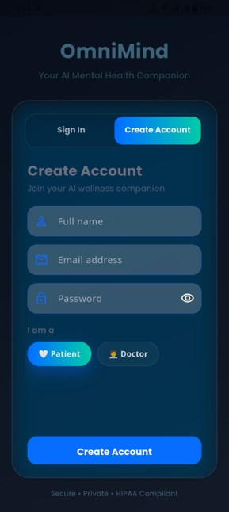<br/>
<sub><b>Create Account</b> — Role selection (Patient/Doctor)</sub>
</td>
<td align="center" width="50%">
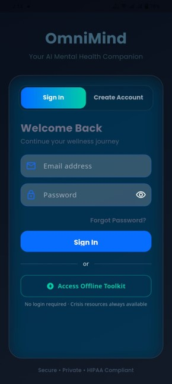<br/>
<sub><b>Sign In</b> — Welcome back + offline toolkit access</sub>
</td>
</tr>
</table>
</div>

---

### Patient Experience

<div align="center">
<table>
<tr>
<td align="center" width="50%">
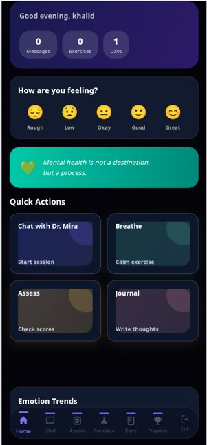<br/>
<sub><b>Patient Dashboard</b> — Mood check-in, quick actions, emotion trends</sub>
</td>
<td align="center" width="50%">
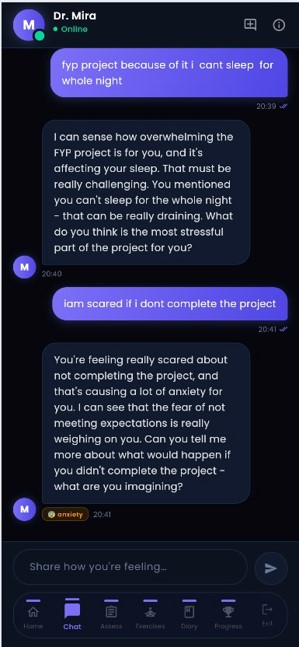<br/>
<sub><b>AI Chat (Dr. Mira)</b> — LLM + RAG conversational therapy</sub>
</td>
</tr>
<tr>
<td align="center" width="50%">
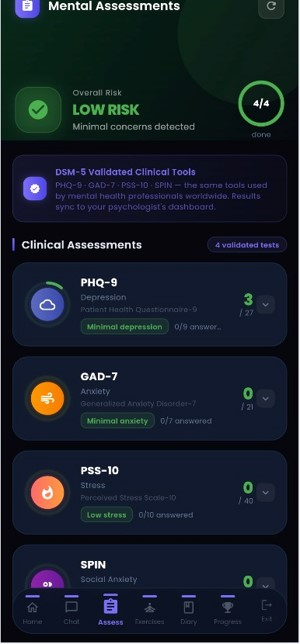<br/>
<sub><b>Clinical Assessment</b> — PHQ-9, GAD-7, PSS-10, SPIN</sub>
</td>
<td align="center" width="50%">
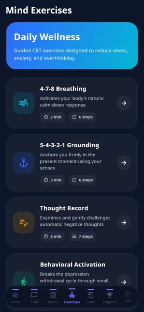<br/>
<sub><b>Mind Exercises</b> — Breathing, grounding, CBT thought records</sub>
</td>
</tr>
<tr>
<td align="center" width="50%">
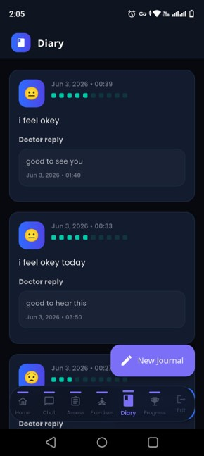<br/>
<sub><b>Diary / Journaling</b> — Emotion tracking & reflective prompts</sub>
</td>
<td align="center" width="50%">
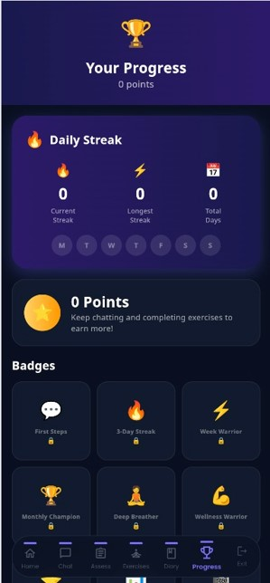<br/>
<sub><b>Gamification</b> — Badges, streaks, and engagement milestones</sub>
</td>
</tr>
</table>
</div>

---

### Doctor / Clinician Experience

<div align="center">
<table>
<tr>
<td align="center" width="50%">
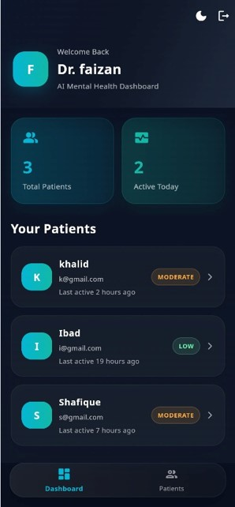<br/>
<sub><b>Doctor Dashboard</b> — Total/active patients overview</sub>
</td>
<td align="center" width="50%">
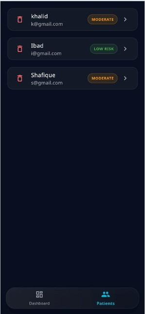<br/>
<sub><b>Patient List</b> — Risk-level indicators per patient</sub>
</td>
</tr>
<tr>
<td align="center" width="50%">
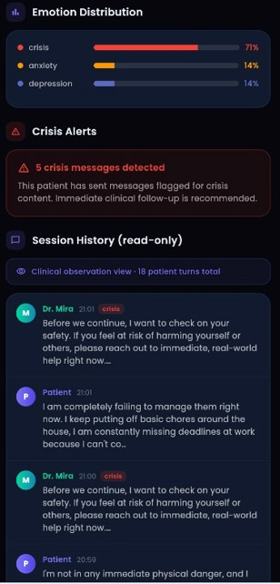<br/>
<sub><b>Clinical Overview</b> — Aggregated patient insights</sub>
</td>
<td align="center" width="50%">
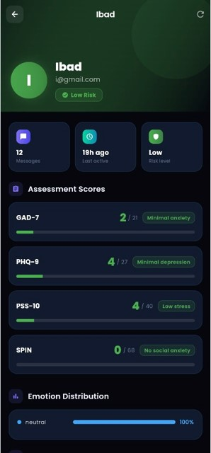<br/>
<sub><b>Individual Patient View</b> — Emotion distribution & crisis alerts</sub>
</td>
</tr>
</table>

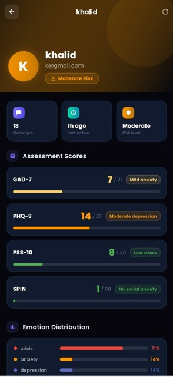<br/>
<sub><b>Session History (Read-Only)</b> — Clinical observation view of chat transcripts</sub>
</div>

---

## 🏗️ System Architecture

OmniMind uses a clean **3-layer architecture** designed for modularity, scalability, and maintainability:

```
┌─────────────────────────────────────────────────────────────┐
│              Layer 1: User Interface Layer                   │
│         Flutter Mobile App  ·  Streamlit Web Prototype       │
└──────────────────────────┬──────────────────────────────────┘
                           │
┌──────────────────────────▼──────────────────────────────────┐
│            Layer 2: Application Logic Layer                  │
│                                                             │
│  ┌─────────────┐  ┌──────────────┐  ┌───────────────────┐  │
│  │ LLM + RAG   │  │  Clinical    │  │ Crisis Detection  │  │
│  │ Conv. Engine│  │  Assessment  │  │     Module        │  │
│  └─────────────┘  └──────────────┘  └───────────────────┘  │
│  ┌─────────────┐  ┌──────────────┐  ┌───────────────────┐  │
│  │  Adaptive   │  │   Emotion    │  │  Gamification     │  │
│  │ Recommender │  │  Detection   │  │     Engine        │  │
│  └─────────────┘  └──────────────┘  └───────────────────┘  │
└──────────────────────────┬──────────────────────────────────┘
                           │
┌──────────────────────────▼──────────────────────────────────┐
│              Layer 3: Data & AI Services Layer               │
│                                                             │
│   Firebase Auth  ·  Firestore  ·  SQLite  ·  FAISS          │
│       PyTorch  ·  HuggingFace  ·  Gemini API  ·  Whisper    │
└─────────────────────────────────────────────────────────────┘
```

### End-to-End Workflow

```
User Input
    │
    ├─► [1] Real-Time Risk Screening  ──► Crisis Protocol (if triggered)
    │
    ├─► [2] Emotion & Intent Analysis (NLP)
    │
    ├─► [3] Clinical Assessment (PHQ-9 / GAD-7 / PSS-10 / SPIN)
    │
    ├─► [4] RAG Retrieval (FAISS + MiniLM-L6-v2)
    │           └─► CBT Techniques · Psychoeducation · Guidelines
    │
    ├─► [5] Prompt Construction (history + emotion + severity + context)
    │
    ├─► [6] LLM Generation (Fine-Tuned LLaMA 3.1-8B / Gemini API)
    │
    ├─► [7] Adaptive Intervention Recommendation
    │
    └─► [8] Progress Logging → Firebase Firestore + SQLite
```

---

## ✨ Features

### 🤖 AI Conversational Therapy
- Powered by **LLM + RAG** (Retrieval-Augmented Generation) architecture
- Fine-tuned **LLaMA 3.1-8B** model adapted specifically for mental health dialogues
- **Google Gemini API** integration for primary response generation
- Multi-turn conversation with full session memory and context retention
- Empathetic, CBT-aligned responses that feel natural, not clinical

### 🧪 Clinical Assessment Suite
- **PHQ-9** — Depression screening (0–27, 5 severity levels)
- **GAD-7** — Anxiety screening (0–21, 4 severity levels)
- **PSS-10** — Perceived Stress Scale (0–40, 3 severity levels)
- **SPIN** — Social Phobia Inventory (0–68, 3 severity levels)
- Conversational (open-ended) assessment questions to complement structured instruments
- Automatic score computation and severity classification per published clinical guidelines

### 🚨 Crisis Detection System
- Keyword-based risk screening validated against the **Columbia-Suicide Severity Rating Scale (C-SSRS)**
- Three-tier detection: **severe** (suicidal ideation), **moderate** (distress), **mild** (early warning)
- Immediate crisis-safe response mode activation
- Display of emergency helplines and resources
- Event logging for clinical review (with user consent)
- User remains in full control — no automatic emergency escalation

### 🎯 Adaptive Intervention Engine
Personalized recommendations based on assessment severity, emotional state, and engagement history:

| Severity | Interventions |
|----------|---------------|
| **Minimal** | Psychoeducation · Wellness tips · Optional check-ins |
| **Mild** | Basic CBT exercises · Mood tracking · Psychoeducation |
| **Moderate** | Structured CBT · Mindfulness training · Weekly assessments |
| **Severe** | Intensive interventions · Crisis protocols · Clinician referral |

**Intervention library includes:**
- 🧠 CBT thought records & cognitive restructuring
- 🌬️ Breathing exercises (Box breathing, 4-7-8, diaphragmatic)
- 🧘 Mindfulness & meditation (body scan, loving-kindness)
- 📓 Journaling prompts (gratitude, emotion tracking, stressor ID)
- 🏃 Behavioral activation & pleasant activity scheduling
- 📚 Psychoeducational modules (depression, anxiety, stress, sleep)

### 📊 Progress Tracking & Gamification
- Line charts for PHQ-9, GAD-7, PSS-10 trends over time
- Engagement frequency bar charts and intervention completion donut charts
- **Gamification** — achievement badges, activity streaks, motivational milestones
- 35% engagement increase demonstrated by gamification research (Torres et al., 2023)

### 👨‍⚕️ Doctor Dashboard
- Role-based access for licensed clinicians
- Patient list with risk level indicators
- Session history (read-only, 18-turn clinical observation view)
- Emotion distribution visualization and crisis alert notifications
- Assessment history review and psychological trend monitoring

### 🔒 Privacy & Security
- Firebase Authentication with AES-256 encryption (Google-managed)
- Firestore encryption at rest and in transit
- SQLite for offline-capable local caching
- Privacy-by-design — minimal data retention, user-controlled deletion
- Non-diagnostic output framing ("suggests mild symptoms", not "you have depression")

---

## 🤖 AI & ML Pipeline

### Fine-Tuned LLaMA 3.1-8B

OmniMind fine-tunes **Meta's LLaMA 3.1-8B** for domain-specific mental health conversations using **Parameter-Efficient Fine-Tuning (PEFT)** with **Low-Rank Adaptation (LoRA)**:

```
Foundation Model: Meta LLaMA 3.1-8B (8B parameters, Transformer Decoder)
Fine-Tuning:      LoRA (ΔW = BA, where r << min(d,k))
Platform:         Kaggle (NVIDIA T4 GPU)
Precision:        FP16
Optimizer:        Paged AdamW 8-bit
Epochs:           10
Frameworks:       Transformers · TRL · PEFT · Unsloth
```

**Training Data Format:**
```
User: I have been feeling anxious lately.
Assistant: It sounds like you're experiencing anxiety. Would you like to 
explore what situations are contributing to these feelings? A helpful 
first step can be identifying common triggers and practicing grounding techniques.
```

### Training Loss Analysis

<div align="center">
<table>
<tr>
<td align="center" width="50%">
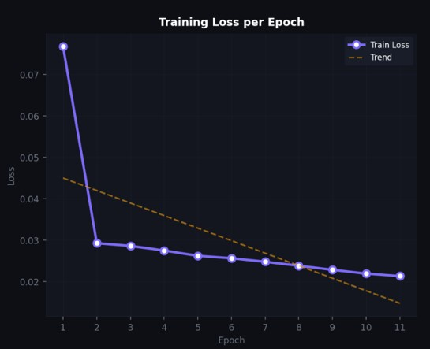<br/>
<sub><b>Training Loss per Epoch</b> — Converges from ~0.077 to ~0.021</sub>
</td>
<td align="center" width="50%">
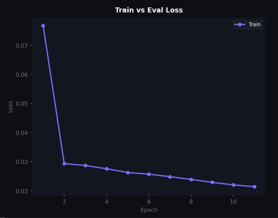<br/>
<sub><b>Train vs Eval Loss</b> — Close tracking indicates minimal overfitting</sub>
</td>
</tr>
</table>

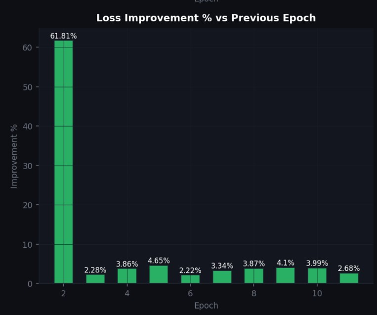<br/>
<sub><b>Loss Improvement % vs Previous Epoch</b> — 61.8% jump at epoch 2, stabilizing to single digits thereafter</sub>
</div>

**Fine-Tuning Results Summary:**

| Epoch | Train Loss | Improvement |
|-------|------------|-------------|
| E1 | 0.0768 | — |
| E2 | 0.0293 | 61.8% |
| E3 | 0.0286 | 2.3% |
| E5 | 0.0263 | 4.7% |
| E10 | 0.0220 | 4.0% |
| E11 | 0.0214 | 2.7% |

### Model Comparison (Base vs Fine-Tuned)

<div align="center">
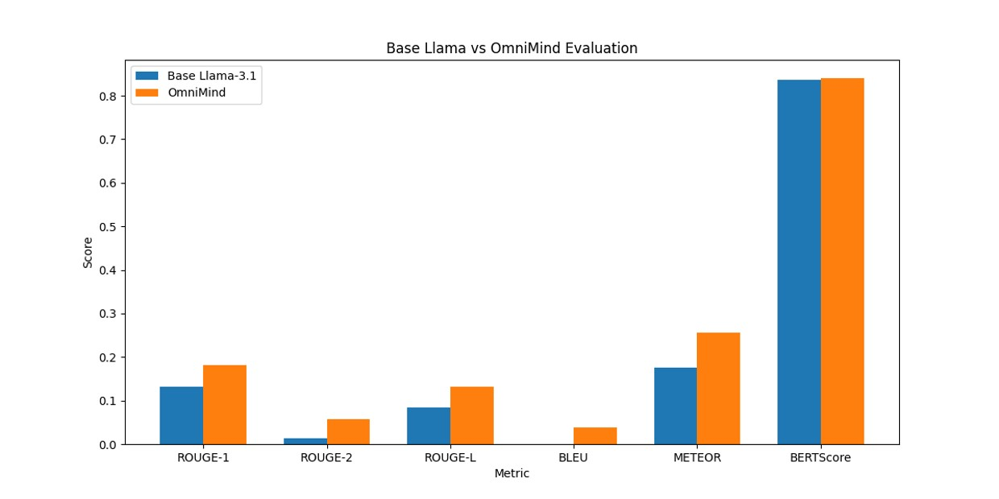<br/>
<sub><b>BERTScore & ROUGE/BLEU/METEOR Comparison</b> — OmniMind (fine-tuned) vs. Base LLaMA 3.1-8B</sub>
</div>

| Metric | Base LLaMA 3.1-8B | OmniMind (Fine-Tuned) |
|--------|-------------------|----------------------|
| ROUGE-1 | 0.1326 | **0.1814** |
| ROUGE-2 | 0.0125 | **0.0567** |
| ROUGE-L | 0.0841 | **0.1312** |
| BLEU | 0.0000 | **0.0383** |
| METEOR | 0.1764 | **0.2560** |
| BERTScore | 0.8359 | **0.8403** |

### RAG Pipeline

```
User Input
    │
    ▼
Embedding Generation (MiniLM-L6-v2)
    │
    ▼
Semantic Search → FAISS Vector Database
    │
    ▼
Top-K Context Retrieval
  · CBT techniques & thought records
  · Psychoeducational resources (depression, anxiety, stress)
  · Mental health guidelines (WHO, NIMH)
  · Crisis management information
  · Breathing & mindfulness scripts
    │
    ▼
Prompt Construction
  [context + conversation history + emotional state + severity level + safety instructions]
    │
    ▼
LLM Generation (Gemini API / Fine-Tuned LLaMA)
    │
    ▼
Therapeutic Response → User
```

### Datasets Used

| Dataset | Source | Size | Purpose |
|---------|--------|------|---------|
| GoEmotions | Google Research | 58,000 Reddit comments | Emotion classification (27 categories) |
| Bangladeshi Student Mental Health Dataset (2024) | Figshare | 2,028 students | Clinical-scale validation (PHQ-9, GAD-7, PSS-10) |

---

## 🏥 Clinical Assessment Module

### Standardized Instruments

| Instrument | Full Name | Items | Score Range | Severity Levels |
|------------|-----------|-------|-------------|-----------------|
| **PHQ-9** | Patient Health Questionnaire-9 | 9 | 0–27 | Minimal · Mild · Moderate · Mod. Severe · Severe |
| **GAD-7** | Generalized Anxiety Disorder Scale-7 | 7 | 0–21 | Minimal · Mild · Moderate · Severe |
| **PSS-10** | Perceived Stress Scale-10 | 10 | 0–40 | Low · Moderate · High |
| **SPIN** | Social Phobia Inventory | 17 | 0–68 | Mild · Moderate · Severe |

All instruments are implemented per their **published clinical guidelines** and manually validated for scoring accuracy.

<div align="center">
<br/>
<sub><b>In-App Assessment</b> — DSM-5 validated clinical tools with live scoring</sub>
</div>

### Conversational Assessment Layer

Supplements structured instruments with open-ended questions that reduce clinical pressure and encourage natural emotional expression:

- *"How has your energy level been over the past few days?"*
- *"Have there been moments when you felt overwhelmed recently?"*
- *"What activities, if any, have helped you feel better this week?"*

### Keyword Risk Categories

| Risk Level | Example Triggers |
|------------|-----------------|
| **Suicidal Ideation** | "kill myself", "end my life", "want to die" |
| **Self-Harm** | "hurt myself", "cut myself", "burn myself" |
| **Crisis Expressions** | "hopeless", "no reason to live", "can't go on" |
| **Severe Distress** | "paralyzed", "suicidal", "worthless", "constant panic" |

---

## 🛠️ Technology Stack

### Mobile Application
| Component | Technology |
|-----------|------------|
| Frontend Framework | Flutter (Dart) |
| State Management | Provider |
| Local Storage | SQLite |

### AI & Backend
| Component | Technology |
|-----------|------------|
| Primary LLM | Google Gemini API |
| Fine-Tuned Model | LLaMA 3.1-8B (LoRA via PEFT) |
| RAG Framework | LangChain |
| Vector Database | FAISS |
| Embedding Model | Sentence Transformers (MiniLM-L6-v2) |
| NLP Libraries | NLTK, SpaCy |
| Deep Learning | PyTorch, TensorFlow |
| Model Hub | HuggingFace Transformers, TRL, Unsloth |
| Speech-to-Text | OpenAI Whisper, Google STT |
| Prototyping | Streamlit |

### Cloud & Infrastructure
| Component | Technology |
|-----------|------------|
| Authentication | Firebase Authentication |
| Cloud Database | Firebase Firestore |
| Offline Cache | SQLite |
| Training Platform | Kaggle (NVIDIA T4 GPU) |

---

## 📁 Project Structure

```
OmniMind/
│
├── assets/                               # README images (screens, charts)
│   ├── signup_screen.jpg
│   ├── signin_screen.jpg
│   ├── patient_dashboard_screen.jpg
│   ├── patient_chat_screen.jpg
│   ├── patient_assesment_screen.jpg
│   ├── patient_exercises_screen.jpg
│   ├── patient_diary_screen.jpg
│   ├── gamification_screen.jpg
│   ├── doctor_dashboard_screen.jpg
│   ├── doctor_existing_patients_screen.jpg
│   ├── doctor_overviewing_screen.jpg
│   ├── doctor_overviewing_individual_patient_screen.jpg
│   ├── doctor_overviewing_individual_patient_screen_2.jpg
│   ├── training_loss_per_epoch.jpg
│   ├── train_vs_eval_loss.jpg
│   ├── loss_improvement_vs_previous_epoch.jpg
│   └── Base_model_vs_finetuned_model_visualization.jpg
│
├── omnimind_project_application/        # Flutter mobile application
│   ├── lib/
│   │   ├── main.dart                    # App entry point
│   │   ├── models/                      # Data models
│   │   │   ├── user_model.dart
│   │   │   ├── assessment_model.dart
│   │   │   ├── mood_model.dart
│   │   │   ├── diary_model.dart
│   │   │   └── chat_message_model.dart
│   │   ├── services/                    # Business logic & API services
│   │   │   ├── auth_service.dart        # Firebase Authentication
│   │   │   ├── firestore_service.dart   # Cloud database
│   │   │   ├── groq_llm_service.dart    # LLM API integration
│   │   │   ├── emotion_service.dart     # Emotion detection
│   │   │   ├── crisis_service.dart      # Crisis keyword detection
│   │   │   └── assessment_service.dart  # PHQ-9, GAD-7, PSS-10, SPIN
│   │   ├── screens/                     # UI screens
│   │   │   ├── auth/                    # Login & Registration
│   │   │   ├── dashboard/              # Patient & Doctor dashboards
│   │   │   ├── chat/                   # AI conversational interface
│   │   │   ├── assessment/             # Clinical assessment flow
│   │   │   ├── exercises/              # Intervention library
│   │   │   ├── diary/                  # Journaling module
│   │   │   └── progress/               # Progress tracking & charts
│   │   └── providers/                  # State management
│   │       └── progress_provider.dart
│   ├── android/                         # Android build files
│   ├── ios/                             # iOS build files
│   └── pubspec.yaml                     # Flutter dependencies
│
├── omnimind_fine_tuning_ipynbs/         # LLaMA fine-tuning notebooks
│   ├── omnimind_llama_finetune.ipynb    # LoRA fine-tuning pipeline
│   ├── model_evaluation.ipynb           # BERTScore, ROUGE, BLEU evaluation
│   └── rag_pipeline.ipynb               # RAG setup & knowledge base
│
└── README.md
```

---

## 🚀 Getting Started

### Prerequisites

- [Flutter SDK](https://flutter.dev/docs/get-started/install) (3.x or higher)
- [Dart](https://dart.dev/get-dart) (included with Flutter)
- [Python](https://python.org) 3.10+
- [Firebase CLI](https://firebase.google.com/docs/cli)
- A [Google Firebase](https://console.firebase.google.com) project
- [Gemini API Key](https://ai.google.dev) (Google AI Studio)
- [Kaggle account](https://kaggle.com) (for GPU-based fine-tuning)

---

### Flutter App Setup

**1. Clone the repository**
```bash
git clone https://github.com/Ibad-Ur-Rahman-Memon/OmniMind.git
cd OmniMind/omnimind_project_application
```

**2. Install Flutter dependencies**
```bash
flutter pub get
```

**3. Configure Firebase**

Follow the [Firebase Configuration](#firebase-configuration) section below, then place your `google-services.json` (Android) and `GoogleService-Info.plist` (iOS) into the appropriate directories.

**4. Set up environment variables**

Create a `.env` file or configure API keys in your app's constants file (see [Environment Variables](#-environment-variables)).

**5. Run the application**
```bash
# For debug mode
flutter run

# For release build (Android)
flutter build apk --release

# For release build (iOS)
flutter build ios --release
```

---

### Python Backend & Fine-Tuning Setup

**1. Navigate to the notebooks directory**
```bash
cd OmniMind/omnimind_fine_tuning_ipynbs
```

**2. Install Python dependencies**
```bash
pip install torch transformers datasets peft trl unsloth langchain \
            faiss-cpu sentence-transformers streamlit nltk spacy \
            google-generativeai bert-score rouge-score evaluate
```

**3. Run fine-tuning (Kaggle recommended for GPU)**

Upload `omnimind_llama_finetune.ipynb` to Kaggle, enable the NVIDIA T4 GPU accelerator, and run all cells. The trained LoRA adapters will be saved to Hugging Face Hub.

**4. Run the Streamlit prototype**
```bash
streamlit run app.py
```

---

### Firebase Configuration

**1. Create a Firebase project** at [console.firebase.google.com](https://console.firebase.google.com)

**2. Enable the following services:**
- Authentication (Email/Password + Google Sign-In)
- Firestore Database (start in production mode)
- Firebase Storage (optional, for file uploads)

**3. Set up Firestore security rules:**
```javascript
rules_version = '2';
service cloud.firestore {
  match /databases/{database}/documents {
    match /users/{userId} {
      allow read, write: if request.auth != null && request.auth.uid == userId;
    }
    match /assessments/{docId} {
      allow read, write: if request.auth != null;
    }
    match /chatMessages/{docId} {
      allow read, write: if request.auth != null;
    }
  }
}
```

**4. Download config files:**
- Android: `google-services.json` → `omnimind_project_application/android/app/`
- iOS: `GoogleService-Info.plist` → `omnimind_project_application/ios/Runner/`

---

## 🔐 Environment Variables

Create a `lib/config/constants.dart` file (do **not** commit to version control):

```dart
class AppConstants {
  // Gemini API
  static const String geminiApiKey = 'YOUR_GEMINI_API_KEY';
  
  // Groq API (optional, for alternative LLM)
  static const String groqApiKey = 'YOUR_GROQ_API_KEY';
  
  // HuggingFace (for fine-tuned model)
  static const String hfToken = 'YOUR_HF_TOKEN';
  static const String hfModelId = 'your-username/omnimind-llama-3.1-8b';
  
  // Firebase is auto-configured via google-services.json
}
```

> ⚠️ **Never commit API keys to version control.** Add `lib/config/constants.dart` to your `.gitignore`.

---

## 📊 Results & Evaluation

### Fine-Tuning Performance

The LLaMA 3.1-8B model was successfully fine-tuned over 10 epochs with consistent loss convergence:

- **Initial training loss (E1):** 0.0768
- **Final training loss (E11):** 0.0214
- **Total improvement:** ~72% reduction in training loss
- **Peak single-epoch improvement:** 61.8% (E1 → E2)
- **Generalization:** Training and evaluation losses tracked closely — no significant overfitting detected

### Model Quality Improvements

The fine-tuned OmniMind model outperforms the base LLaMA 3.1-8B across all evaluated metrics, demonstrating superior contextual understanding, therapeutic response generation, empathy, conversational consistency, and mental-health-specific reasoning.

### RAG System Performance

| Dimension | Result |
|-----------|--------|
| Retrieval Relevance | High semantic similarity for most queries |
| Response Clinical Appropriateness | Significantly improved over standalone LLM |
| Conversational Quality | Empathetic, supportive, and contextually coherent across multi-turn dialogues |
| Known Limitation | Slight degradation on culturally specific or highly idiomatic expressions |

### Clinical Validation

- PHQ-9, GAD-7, PSS-10, and SPIN scoring manually verified against published guidelines — **100% scoring accuracy**
- Conversational assessment module reviewed by a licensed psychologist (PMDC-registered Hypnotherapist)
- Crisis detection system successfully identified all high-risk test phrases and activated safety protocols
- Clinical validation consultation conducted at Sukkur IBA University (November 2025)

### System Implementation

OmniMind achieved **~95% implementation completion** at final evaluation, with all major components fully functional and integrated:

✅ User Authentication & Registration  
✅ Clinical Assessment Engine (PHQ-9, GAD-7, PSS-10, SPIN)  
✅ Conversational Assessment Module  
✅ Crisis Detection & Safety Protocols  
✅ Fine-Tuned LLM Chatbot  
✅ RAG Knowledge Retrieval Framework  
✅ Adaptive Intervention Recommendation Engine  
✅ Progress Tracking Dashboard  
✅ Gamification Module (Badges, Streaks)  
✅ Doctor/Clinician Dashboard  
✅ Offline Data Storage (SQLite)  
✅ Firebase Cloud Integration  

---

## ⚖️ Ethical & Privacy Considerations

OmniMind was built with ethics as a core design principle, guided by **beneficence, non-maleficence, autonomy, and justice**.

| Principle | Implementation |
|-----------|----------------|
| **Informed Consent** | Clear consent form explaining data collection, storage, access, and limitations before first use |
| **Data Encryption** | AES-256 for credentials; Firestore encrypted at rest and in transit; local SQLite encrypted |
| **Privacy by Design** | Minimal data retention; anonymization for research; local processing to reduce cloud transmission |
| **Non-Diagnostic Output** | Framed as "suggests symptoms" not "you have [condition]" — per regulatory best practices |
| **Crisis Safety** | Immediate safe-response mode; emergency resource display; user retains full control |
| **Clinical Grounding** | All assessment instruments clinically validated; reviewed by licensed psychologist |

> 🚨 **Important:** OmniMind is **not a replacement for professional psychiatric diagnosis or treatment**. It is designed as a supportive screening and self-help tool for mild-to-moderate psychological distress. Users identified at severe risk are strongly directed to qualified mental health professionals.

---

## ⚠️ Limitations

| Limitation | Description |
|------------|-------------|
| **Limited User Evaluation** | Tested with a small pilot group; findings not yet generalizable to larger populations |
| **English Only** | Current NLP pipeline supports English; Urdu/Sindhi not yet implemented |
| **Rule-Based Crisis Detection** | Keyword matching may miss subtle, indirect, or culturally nuanced distress expressions |
| **External API Dependency** | Full AI functionality requires internet connectivity and API availability |
| **No Formal RCT** | Clinical effectiveness (not just technical performance) not yet validated through controlled trials |
| **Knowledge Base Scope** | Rare or highly specialized mental health scenarios may not be covered in the RAG knowledge base |
| **Non-Diagnostic** | Cannot provide formal psychiatric diagnoses or prescribe treatments |

---

## 🔭 Future Work

| Direction | Description |
|-----------|-------------|
| 🌐 **Multilingual NLP** | Urdu and Sindhi language support to expand accessibility across Pakistan |
| 😊 **Multimodal Emotion Detection** | Facial expression + vocal characteristic analysis alongside text |
| 🧠 **ML-Based Crisis Detection** | Replace keyword matching with context-aware deep learning risk models |
| 👩‍⚕️ **Therapist Dashboard Expansion** | Full remote supervision portal for licensed clinicians with consent-gated access |
| ⌚ **Wearable Integration** | Smartwatch physiological signals (HRV, sleep, activity) feeding the emotion model |
| 🧪 **Randomized Controlled Trial** | Formal RCT comparing OmniMind vs. control group for clinical efficacy evidence |
| 📦 **Production Deployment** | Cloud deployment, regulatory compliance (HIPAA considerations), healthcare partnerships |
| 🤖 **Continuous Model Improvement** | Larger domain datasets, RLHF, advanced retrieval mechanisms, newer LLM architectures |
| 📝 **Research Publication** | Submission to peer-reviewed venues in digital health, AI in medicine, and HCI |

---

## 👥 Team

<table>
  <tr>
    <td align="center">
      <strong>Ibad Ur Rahman</strong><br/>
      <sub>Student ID: 133-22-0004</sub><br/>
      <sub>BE Computer Systems Engineering</sub><br/>
      <sub>Sukkur IBA University</sub><br/>
      📧 <a href="mailto:ibad.cse@gmail.com">ibad.cse@gmail.com</a><br/>
      📧 <a href="mailto:ibadurrahmanmemon.becsef22@iba-suk.edu.pk">ibadurrahmanmemon.becsef22@iba-suk.edu.pk</a>
    </td>
    <td align="center">
      <strong>Khalid Hussain</strong><br/>
      <sub>Student ID: 133-22-0011</sub><br/>
      <sub>BE Computer Systems Engineering</sub><br/>
      <sub>Sukkur IBA University</sub><br/>
      📧 <a href="mailto:khalidhussain.becsef22@iba-suk.edu.pk">khalidhussain.becsef22@iba-suk.edu.pk</a>
    </td>
    <td align="center">
      <strong>Shafique Ahmed</strong><br/>
      <sub>Student ID: 133-20-0006</sub><br/>
      <sub>BE Computer Systems Engineering</sub><br/>
      <sub>Sukkur IBA University</sub><br/>
      📧 <a href="mailto:shafiqueahmed.becsef22@iba-suk.edu.pk">shafiqueahmed.becsef22@iba-suk.edu.pk</a>
    </td>
  </tr>
</table>

---

## 👨‍🏫 Supervisor & Co.

**Dr. Abdul Sattar Chan**  
Department of Computer Systems Engineering  
Sukkur IBA University, Sukkur, Pakistan  
📧 [abdul.sattar@iba-suk.edu.pk](mailto:abdul.sattar@iba-suk.edu.pk)

**Engr. Umair Ayaz Kamangar**  
Department of Computer Systems Engineering  
Sukkur IBA University, Sukkur, Pakistan  
📧 [umair.ayaz@iba-suk.edu.pk](mailto:umair.ayaz@iba-suk.edu.pk)

---

## 🙏 Acknowledgements

- **Dr. Abdul Sattar Chan and Engr. Umair Ayaz Kamangar** — for guidance, mentorship, and shaping the research direction throughout the FYP
- **Sukkur IBA University** — for providing the academic environment, resources, and facilities
- **Pakistan Engineering Council (PEC)** — for support enabling successful project completion
- **Abdul Rehman Memon** (PMDC-Registered Psychologist & Hypnotherapist) — for clinical validation consultation and sign-off on the OmniMind therapeutic framework
- **Meta AI** — for the open-source LLaMA 3.1 model family
- **Google** — for the Gemini API and Firebase platform
- **HuggingFace** — for Transformers, PEFT, TRL, and the open-source ML ecosystem

---

## 📚 Key References

- Smith et al. (2022) — AI Technologies for Mental Health Monitoring. *IEEE Xplore*
- Khan & Gupta (2024) — AI-Based Crisis Detection. *Journal of Healthcare Informatics Research*
- Lee et al. (2023) — Real-Time Emotion Recognition via Deep Learning. *SpringerOpen*
- Torres et al. (2023) — Gamification in Mental Health: A Systematic Review. *Frontiers in Psychiatry*
- WHO (2022) — World Mental Health Report: Transforming Mental Health for All
- Columbia-Suicide Severity Rating Scale (C-SSRS) — [cssrs.columbia.edu](https://cssrs.columbia.edu)

---

## 📄 License

This project is licensed under the **MIT License** — see the [LICENSE](LICENSE) file for details.

> This project was developed as a **Final Year Project (FYP)** for the degree of Bachelor of Engineering in Computer Systems Engineering at Sukkur IBA University (June 2026). All research, implementation, and documentation represent original work by the authors.

---

<div align="center">

**⭐ If OmniMind resonates with you or your work, please consider giving the repository a star!**

*Built with ❤️ at Sukkur IBA University · Making mental healthcare accessible for everyone*

</div>
